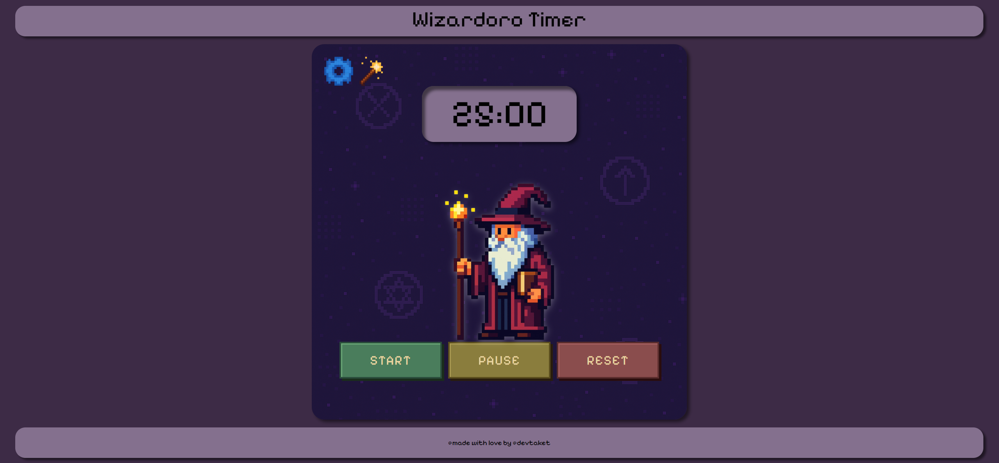

# Wizardoro Timer

A magical and enchanting Pomodoro timer designed to boost your productivity with a touch of wizardry! This web-based application helps you manage your work and break intervals with a charming wizard theme, complete with visual effects and sound notifications.


## Features

*   **Pomodoro Timer:** Set focused work intervals and short breaks.
*   **Customizable Durations:** Choose from preset timer durations (10, 15, 20, 25 minutes).
*   **Start, Pause, Reset:** Full control over your timer sessions.
*   **Magical Particles:** Toggle captivating particle animations around the wizard with a click of the wand.
*   **Audio Notification:** A pleasant ring sound signals the end of a timer session.
*   **Responsive Design:** Enjoy the Wizardoro Timer on various screen sizes, from desktop to mobile.
*   **Enchanting Theme:** A unique wizard-inspired interface with custom fonts and graphics.

## Technologies Used

*   **HTML5:** For the structure of the web application.
*   **CSS3:** For styling, animations, and responsive design.
*   **JavaScript:** For all interactive functionalities, including timer logic, menu toggling, and particle effects.

## How to Use

1.  **Open `index.html`:** Simply open the `index.html` file in your web browser.
2.  **Select Time:** Click the "Settings" icon (gear) to open the menu and choose your desired work interval (e.g., 25 min).
3.  **Start Timer:** Click the "Start" button to begin your focused session.
4.  **Pause/Reset:** Use the "Pause" button to temporarily stop the timer, or "Reset" to return it to the selected duration.
5.  **Toggle Particles:** Click the "Wand" icon to activate or deactivate the magical particle animations.
6.  **Sound Notification:** A sound will play when the timer reaches zero.

## Installation (Local Setup)

To run this project locally:

1.  **Clone the repository:**
    ```bash
    git clone https://ruta-zum-repo-hier-einfügen.git
    cd Wizardoro-Timer-main
    ```
2.  **Open with a Web Browser:**
    Simply open the `index.html` file located in the root directory with any modern web browser (e.g., Chrome, Firefox, Safari).

## Project Structure

```
.
├── index.html
├── script.js
├── style.css
├── .vscode/
│   └── settings.json
└── assets/
    ├── img/
    │   ├── background.png
    │   ├── border.png
    │   ├── favicon-32x32.png
    │   ├── wizard.png
    │   └── icons/
    │       ├── settings.png
    │       └── wand.png
    │   └── particles/
    │       ├── one_blue_paricle.png
    │       ├── one_particle.png
    │       └── particles.png
    └── sounds/
        └── ring.wav
```

## Contributing

Contributions are welcome! If you have suggestions for improvements or new features, please feel free to:

1.  Fork the repository.
2.  Create a new branch (`git checkout -b feature/your-feature-name`).
3.  Make your changes.
4.  Commit your changes (`git commit -m 'Add new feature'`).
5.  Push to the branch (`git push origin feature/your-feature-name`).
6.  Open a Pull Request.

---
Made with ❤️ by [@devtaket](https://github.com/devtaket)
